# The Little Cardinal's Promise

**Rob Brizzi • Cardinal Press • 2026**

---

## [Page 1 – Title page]

The Little Cardinal's Promise

## [Page 2 – Half title / author]

THE LITTLE CARDINAL'S PROMISE
Rob Brizzi

## [Page 3 – Copyright]

Copyright © 2026 Rob Brizzi. All rights reserved.
No part of this book may be reproduced without permission.
Cardinal Press • First edition, 2026

## [Page 4 – Dedication]

For the ones watching the windows.

> **[Illustration: Family-album wedding memory – Dad in a tux, the bride, and young Rob as ring bearer]**

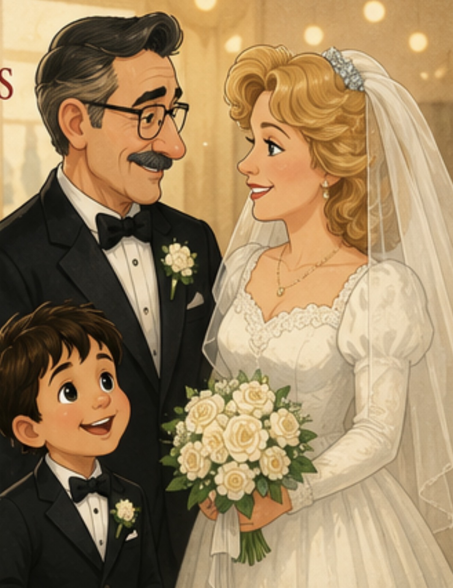

## [Pages 5–6]

Rob's dad was the kind of dad
who showed up —
in his blue shirt, arms open,
every single time.

> **[Illustration: Grandpa + young Rob lap hug (uploaded warm family portrait with mustache dad + boy in red shirt)]**

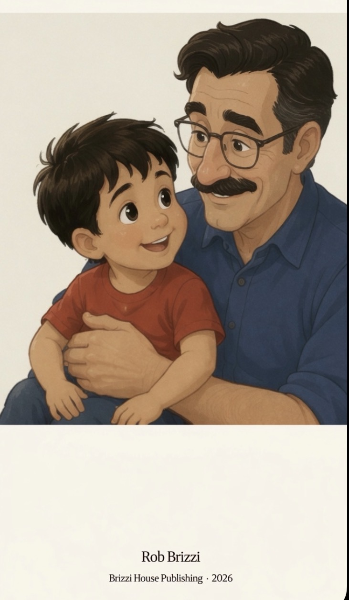

## [Pages 7–8]

He came to the games Rob won,
and the games Rob lost.
Always in the third row.
Blue shirt. Arms crossed. Watching. Proud.

> **[Illustration: Bleachers – arm around shoulder, "Brizzi" shirt (corrected print-res version from the companion interior; earlier "Ramsey" draft kept at illustrations/ramsey-bleachers.jpeg)]**

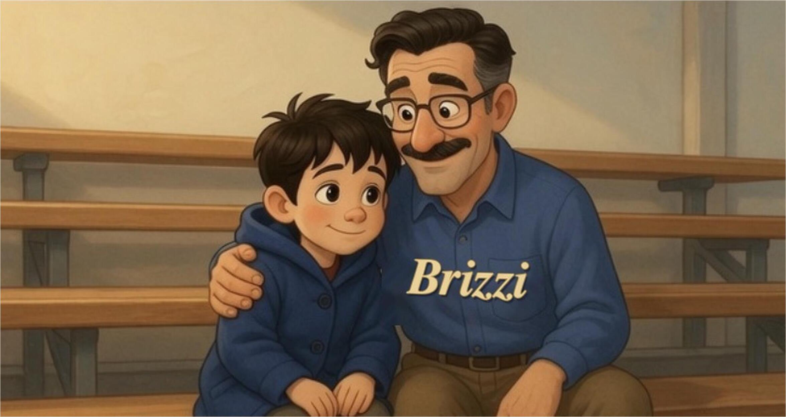

## [Pages 9–10]

Saturdays were for fly balls.
A hundred of them, then a hundred more.
"One more," Dad always said,
kneeling in the grass with that proud smile.

> **[Illustration: Doorway serious talk (red shirt boy + open-palm Dad – IMG_3927) + small Yankees cap inset]**

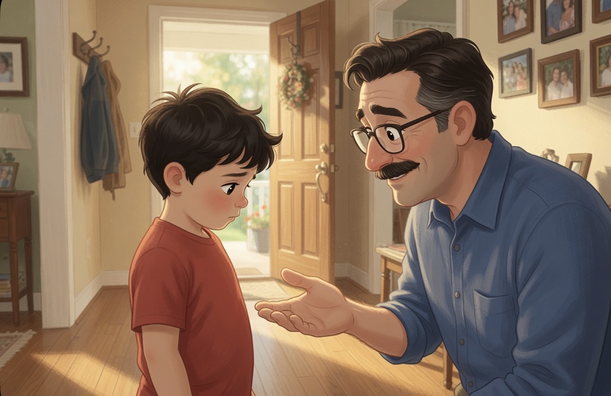

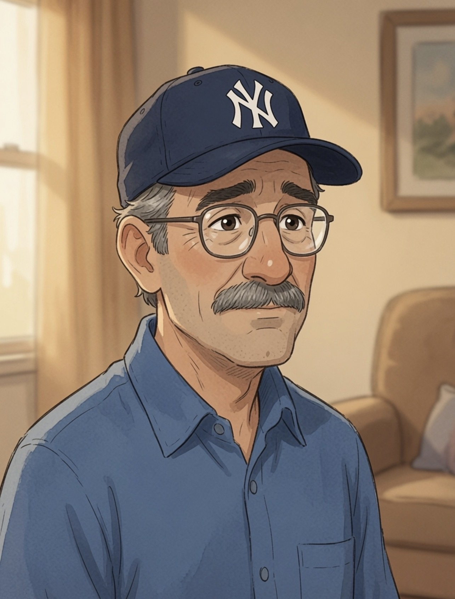

## [Pages 11–12]

Dad made one promise, and only one.
"No matter what," he said, kneeling with the ball,
"I will always show up for you."

> **[Illustration: Mirror hug – boy in blue coat, Dad beaming behind (IMG_3925)]**

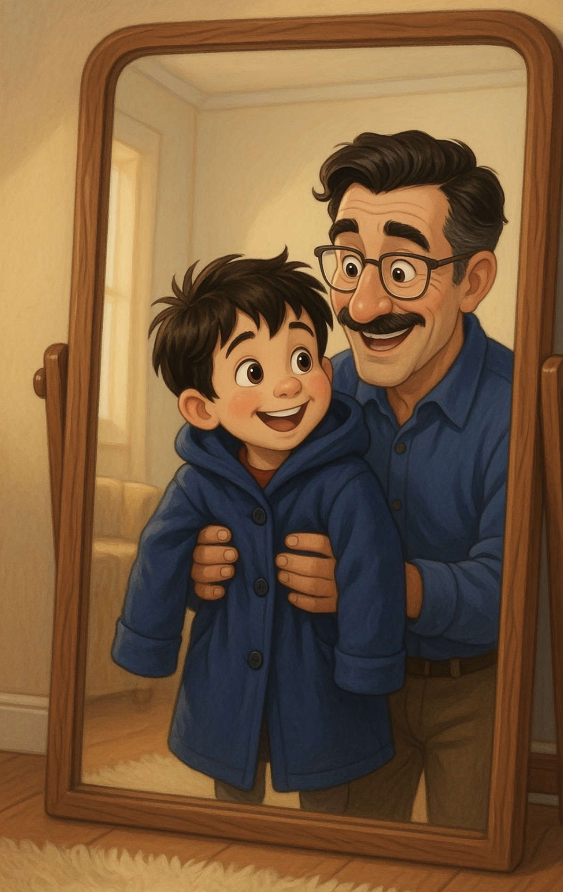

## [Added spread – torn jacket memory]

Dad's old blue shirt was too big…
but Rob wore it anyway.
It still smelled like Saturday mornings.

> **[Illustration: Torn jacket scene (frayed blue jacket with Dad smiling behind)]**

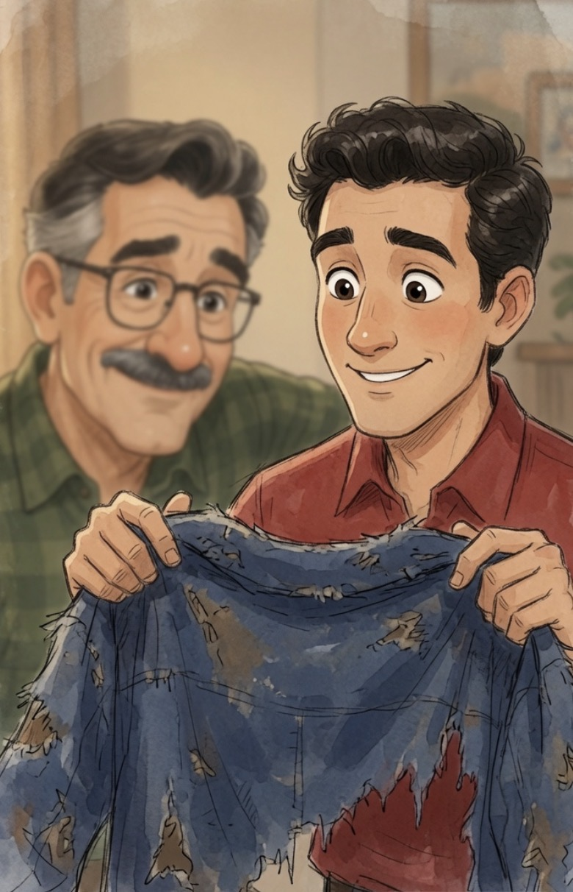

## [Pages 13–14]

One winter, Dad got sick.
His naps got longer. His voice got softer.
But when Rob sat beside him,
Dad still smiled the smile that meant:
you're mine, and I'm glad.

> **[Illustration: Hospital bedside (adult Rob holding Dad's hand – IMG_3948)]**

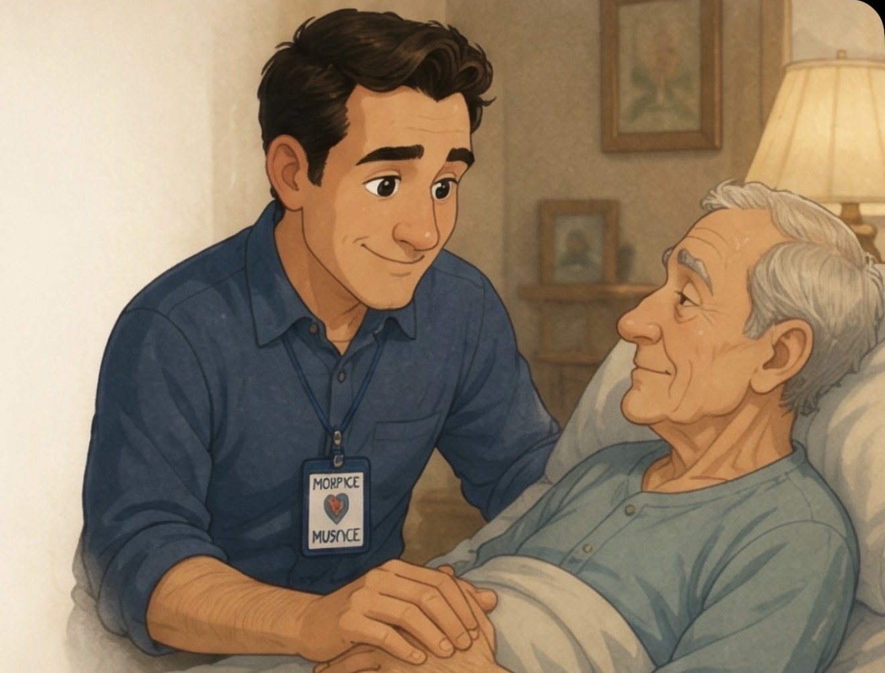

## [Pages 15–16]

"Then who will show up for me?" Rob asked.
Dad heard him. He held out his hand.
"Watch for me," Dad whispered.
"I keep my promises."

> **[Illustration: Car window + glowing cardinal (full bleed – IMG_3934 with strong red glow)]**

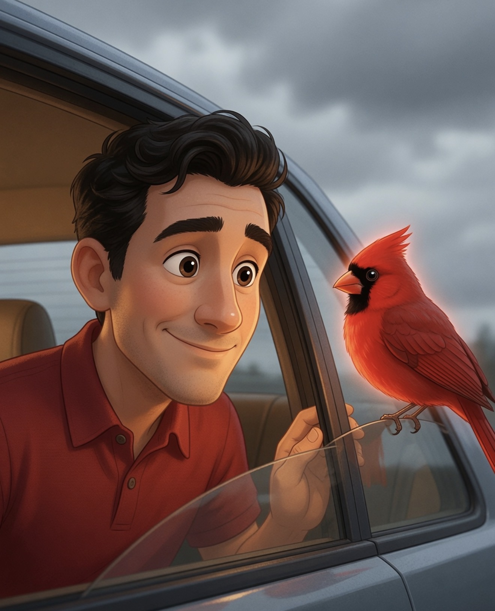

## [Pages 17–18]

Dad died on a snowy day.
The house got quiet. The truck stayed parked.
Rob didn't want breakfast.
He didn't want fly balls.
He didn't want anything at all.

> **[Illustration Prompt (generate in same style): "Snowy winter scene, red pickup truck parked outside a quiet dark house with one warm yellow window glowing, light snow falling, melancholic but hopeful mood, same warm illustrated style as previous family scenes, red truck matches earlier truck image, subtle small silhouette of boy at window, soft emotional children's book illustration"]**

*(artwork pending)*

## [Pages 19–20]

The quiet stayed a long time.

> **[Illustration Prompt: "Empty wooden bleachers covered in fresh snow during winter day, soft snow falling, faint glowing red cardinal perched on top bench as subtle symbol of hope, empty space conveys loss but with gentle warmth, same style as Ramsey bleachers image, children's picture book illustration"]**

*(artwork pending)*

## [Pages 21–22]

One cold morning, Rob heard a tap.
Tap. Tap-tap.

> **[Illustration Prompt: "Young dark-haired Rob sitting alone at kitchen table, looking toward snowy window with hopeful expression, untouched breakfast plate, warm interior lighting contrasting cool window, same character design and style as previous Rob illustrations, gentle emotional children's book art"]**

*(artwork pending)*

## [Pages 23–24]

On the window sat a bird.
Not a brown bird. Not a gray bird.
A bright red bird. Red as Dad's truck.
It looked right at Rob.
And it stayed.

> **[Illustration Prompt: "Vibrant bright red cardinal perched on snowy windowsill, looking directly at viewer with kind expression, soft glowing aura, snow falling outside, young Rob's face partially visible inside, highly detailed emotional close-up in the same style as previous cardinal images, warm children's book illustration"]**

*(artwork pending)*

## [Pages 25–26]

"Mama!" Rob whispered.
"It's not flying away!"
Mama knelt beside him,
and her eyes went shiny.
"You know what some people say about red birds," she said.
"They say a cardinal is how love shows up… after."

> **[Illustration: Mama kneeling with Rob at window (use uploaded family/mama-style images)]**

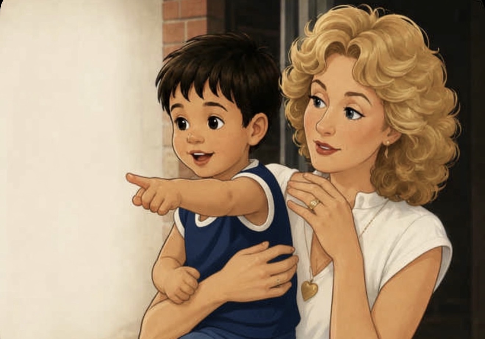

## [Pages 27–28]

Rob put his hand against the cold glass.
"You came," he said, eyes shining.
"You kept your promise."
The cardinal tipped its head —
the exact way Dad did
when he was proud and didn't say so.

> **[Illustration Prompt: "Young Rob's hand pressed against cold window glass touching the bright red cardinal on the other side, snow outside, Rob's face full of wonder and love, soft glowing light from cardinal, emotional, matching hand/car cardinal style, warm children's book illustration"]**

*(artwork pending)*

## [Pages 29–30]

The cardinal didn't come every day.
But it came.
On the first day of school.
At the last game of the season.
On days when Rob missed Dad
so much his chest hurt —
tap. Tap-tap.

> **[Illustration Prompt: "Three vertical panels in one spread: 1) Cardinal on kitchen table with Rob watching 2) Cardinal on snow-covered bleachers 3) Cardinal on rainy window sill, vibrant red glowing cardinal in each, hopeful and consistent with previous cardinal images, same warm illustrated style"]**

*(artwork pending)*

## [Added spread – family, now]

Now, when the world feels too quiet…
watch the windows.
Red keeps its promises.

> **[Illustration: Full family group with chihuahua ("freedom" shirt) – adult Rob, older Dad, blonde woman, dog + flying cardinal overhead (corrected print-res version from the companion interior)]**

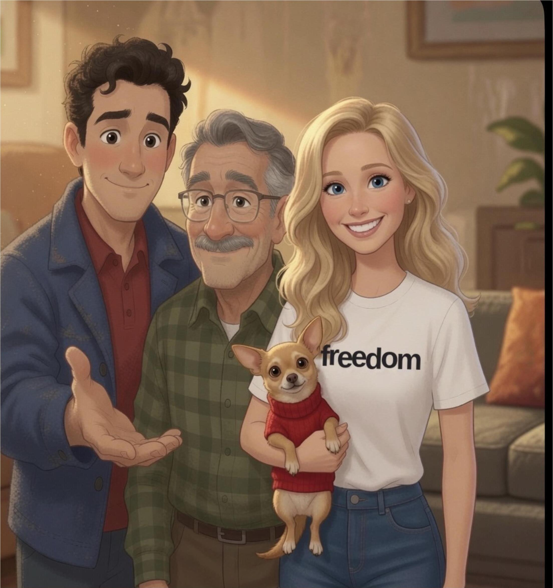

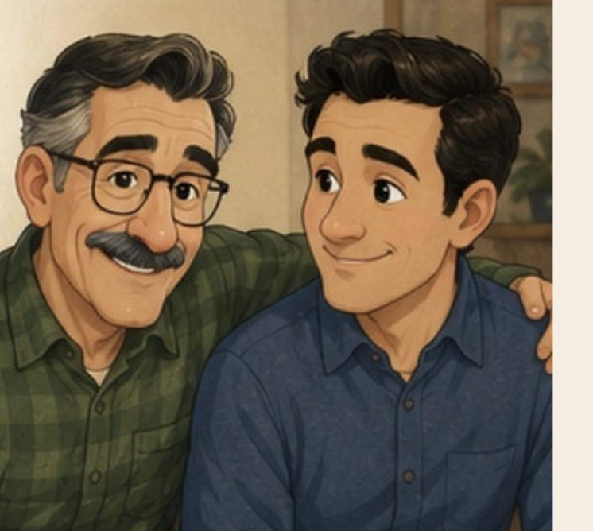

## [Pages 31–32]

And when the cardinal came,
Rob always said the same thing.
"I see you. I love you too."
Because love that shows up
never stops showing up.
It just changes where it sits.

> **[Illustration Prompt: "Young Rob standing in green field looking up at bare tree branch where a bright red cardinal is perched looking down at him, soft hopeful sunlight, simple beautiful composition, same character design and warm emotional style as previous spreads"]**

*(artwork pending)*

## [Pages 33–34]

Now, when the world feels too quiet…
watch the windows.
Watch the fences and the branches and the snow.
Red keeps its promises.

> **[Illustration Prompt: "Hopeful ending spread: bright red cardinal flying across beautiful pink and gold sunset sky above dark house silhouettes, warm glowing light, feeling of continued love and promise kept, full-bleed emotional illustration matching glowing cardinal style"]**

*(artwork pending)*

## [Page 35 – Author Note]

### A NOTE FOR GROWN-UPS

When you talk with a child about death, use the real words. Say died, not went to sleep. Let them see that you miss the person too; grief shared is grief halved, even for the smallest hearts.

And when a red bird lands, let it be a comfort without being a test. The point was never the bird. The point is that love that showed up keeps showing up. It just changes where it sits.

The true story of the cardinal is told in the author's memoir, *The Cardinal's Promise*.

> *Small red cardinal illustration at bottom*

---

Rob Brizzi • 2026
