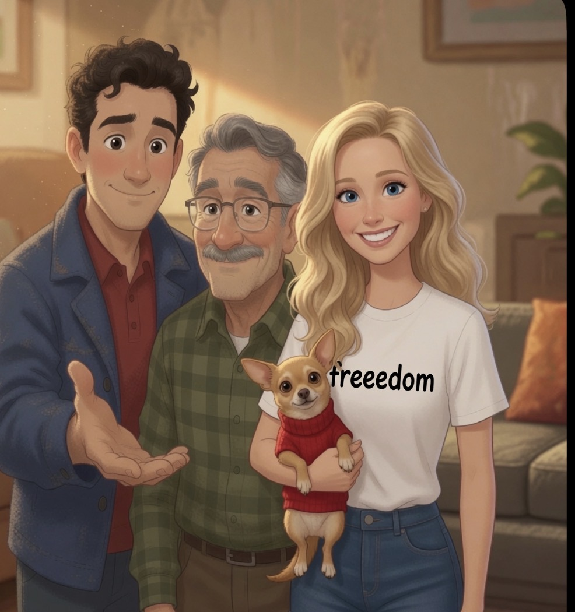

# The Little Cardinal's Promise

**Rob Brizzi • Cardinal Press • 2026**

---

## [Page 1 – Title page]

The Little Cardinal's Promise

## [Page 2 – Half title / author]

THE LITTLE CARDINAL'S PROMISE
Rob Brizzi

## [Page 3 – Copyright]

Copyright © 2026 Rob Brizzi. All rights reserved.
No part of this book may be reproduced without permission.
Cardinal Press • First edition, 2026

## [Page 4 – Dedication]

For the ones watching the windows.

## [Pages 5–6]

Rob's dad was the kind of dad
who showed up —
in his blue shirt, arms open,
every single time.

> *Illustration: Grandpa + young Rob lap hug – warm mustache dad + boy in red shirt image*

## [Pages 7–8]

He came to the games Rob won,
and the games Rob lost.
Always in the third row.
Blue shirt. Arms crossed. Watching. Proud.

> *Illustration: Ramsey bleachers – arm-around-shoulder, "Ramsey" shirt (IMG_3926)*

## [Pages 9–10]

Saturdays were for fly balls.
A hundred of them, then a hundred more.
"One more," Dad always said,
kneeling in the grass with that proud smile.

> *Illustration: Doorway serious talk – red shirt boy + open-palm Dad (IMG_3927) + small Yankees cap inset*

## [Pages 11–12]

Dad made one promise, and only one.
"No matter what," he said, kneeling with the ball,
"I will always show up for you."

> *Illustration: Mirror hug – boy in blue coat, Dad beaming behind (IMG_3925)*

## [New spread – torn jacket image]

Dad's old blue shirt was too big…
but Rob wore it anyway.
It still smelled like Saturday mornings.

> *Illustration: Torn jacket scene – frayed blue jacket with Dad smiling behind*

## [Pages 13–14]

One winter, Dad got sick.
His naps got longer. His voice got softer.
But when Rob sat beside him,
Dad still smiled the smile that meant:
you're mine, and I'm glad.

> *Illustration: Hospital bedside – adult Rob holding Dad's hand, badge visible (IMG_3948)*

## [Pages 15–16]

"Then who will show up for me?" Rob asked.
Dad heard him. He held out his hand.
"Watch for me," Dad whispered.
"I keep my promises."

> *Illustration: Car window + glowing cardinal – full bleed with strong red halo (IMG_3934)*

## [Pages 17–18]

Dad died on a snowy day.
The house got quiet. The truck stayed parked.
Rob didn't want breakfast.
He didn't want fly balls.
He didn't want anything at all.

> *Illustration: Snowy truck + house with red truck detail*

## [Pages 19–20]

The quiet stayed a long time.

> *Illustration: Empty snowy bleachers with faint cardinal shadow*

## [Pages 21–22]

One cold morning, Rob heard a tap.
Tap. Tap-tap.

> *Illustration: Boy at table looking toward window*

## [Pages 23–24]

On the window sat a bird.
Not a brown bird. Not a gray bird.
A bright red bird. Red as Dad's truck.
It looked right at Rob.
And it stayed.

> *Illustration: Red cardinal on snowy windowsill (close-up red bird)*

## [Pages 25–26]

"Mama!" Rob whispered.
"It's not flying away!"
Mama knelt beside him,
and her eyes went shiny.
"You know what some people say about red birds," she said.
"They say a cardinal is how love shows up… after."

> *Illustration: Mama kneeling with Rob at window*

## [Pages 27–28]

Rob put his hand against the cold glass.
"You came," he said, eyes shining.
"You kept your promise."
The cardinal tipped its head —
the exact way Dad did
when he was proud and didn't say so.

> *Illustration: Hand on glass + cardinal (split-panel style)*

## [Pages 29–30]

The cardinal didn't come every day.
But it came.
On the first day of school.
At the last game of the season.
On days when Rob missed Dad
so much his chest hurt —
tap. Tap-tap.

> *Illustration: Three-panel cardinals (table, bleachers, window)*

## [New spread – family group image]

Now, when the world feels too quiet…
watch the windows.
Red keeps its promises.

> *Illustration: Full family group with chihuahua ("freedoom" shirt) + adult Rob, older Dad, blonde woman, dog + flying cardinal overhead (group photo image)*

## [Pages 31–32]

And when the cardinal came,
Rob always said the same thing.
"I see you. I love you too."
Because love that shows up
never stops showing up.
It just changes where it sits.

> *Illustration: Boy looking up at cardinal on tree branch*

## [Pages 33–34]

Now, when the world feels too quiet…
watch the windows.
Watch the fences and the branches and the snow.
Red keeps its promises.

> *Illustration: Flying cardinal at sunset sky*

## [Page 35 – Author Note]

### A NOTE FOR GROWN-UPS

When you talk with a child about death, use the real words. Say died, not went to sleep. Let them see that you miss the person too; grief shared is grief halved, even for the smallest hearts.

And when a red bird lands, let it be a comfort without being a test. The point was never the bird. The point is that love that showed up keeps showing up. It just changes where it sits.

The true story of the cardinal is told in the author's memoir, *The Cardinal's Promise*.

> *Small red cardinal illustration at bottom*

---

## Additional artwork (not yet placed)

---

Rob Brizzi • Brizzi House Publishing • 2026
