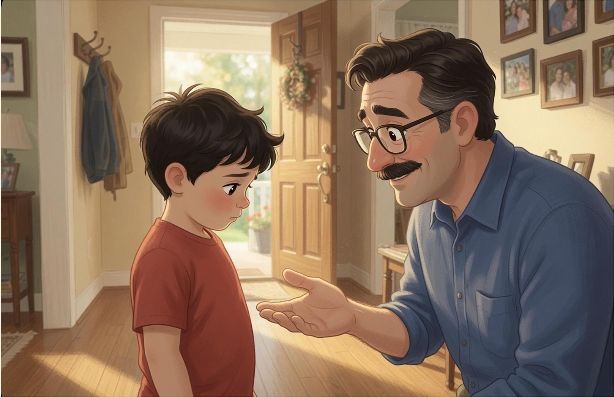
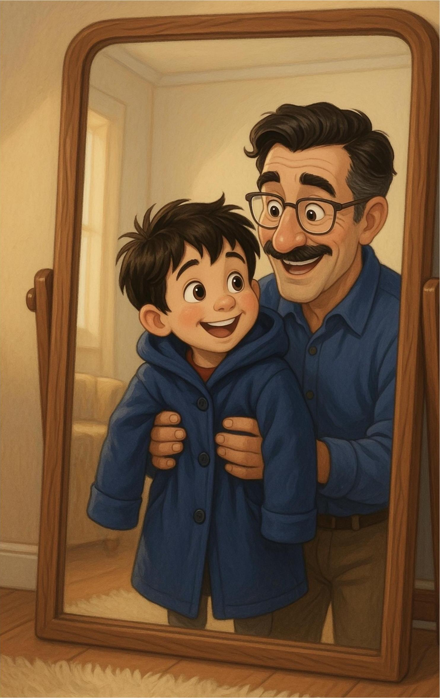
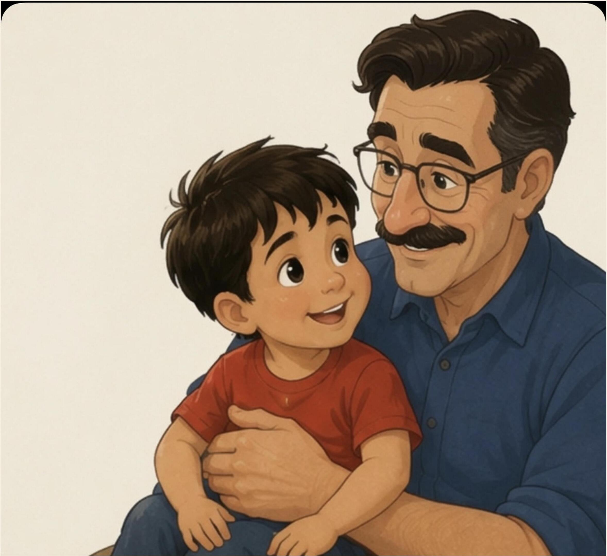
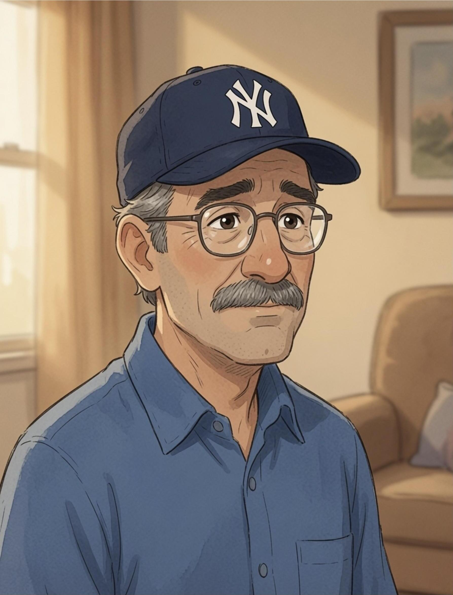
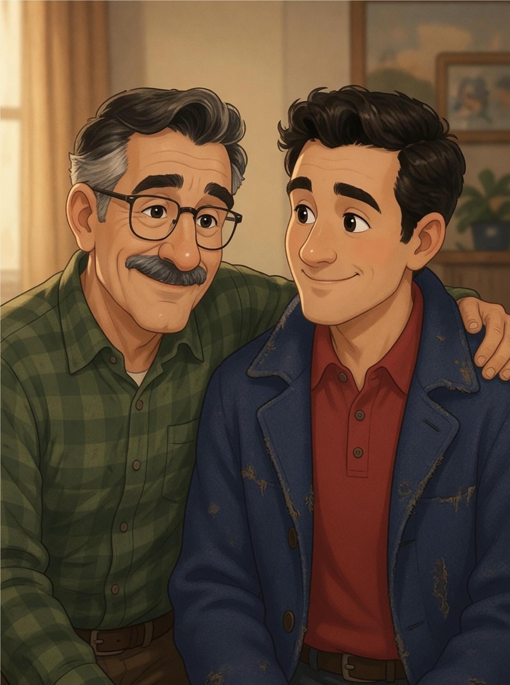
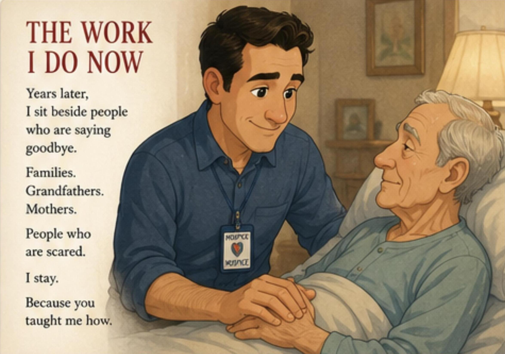
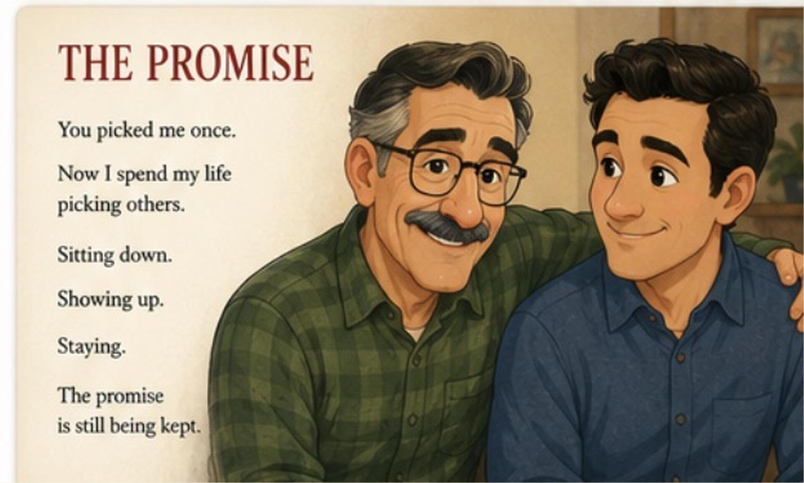
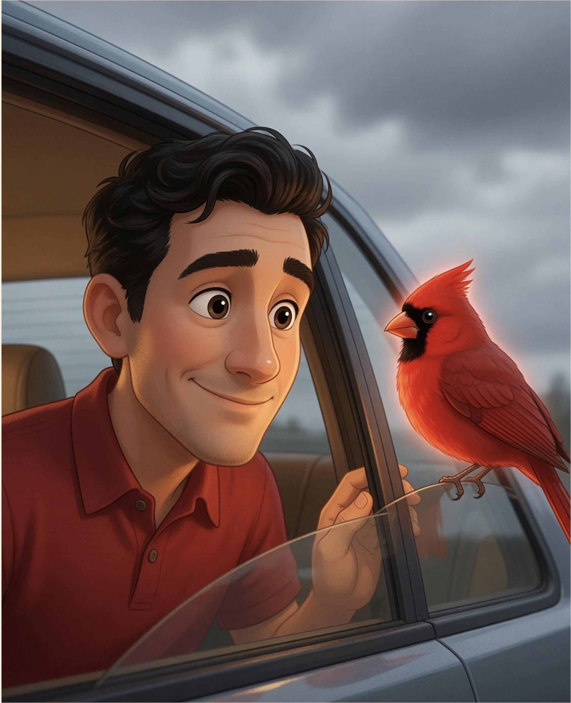

# The Promise: A Name to Grow Into

**Rob Brizzi • Brizzi House Publishing • 2026**

Companion book to *The Little Cardinal's Promise*. Interior transcribed from
`the-promise-interior-8.5x8.5.pdf` (24 pages, 8.5×8.5″ KDP interior with bleed,
~300 DPI full-page art).

---

## [Page 1 – Half title]

The Promise

## [Page 2 – Title page]

THE PROMISE
*A Name to Grow Into*
Rob Brizzi
BRIZZI HOUSE PUBLISHING

## [Page 3 – Copyright]

The Promise: A Name to Grow Into
Copyright © 2026 Rob Brizzi. All rights reserved.
No part of this book may be reproduced without permission.
Brizzi House Publishing
First edition, 2026

## [Page 4 – Dedication]

For the man who picked me —
and for everyone still sitting down,
showing up,
and staying.

## [Page 5 – The Day You Picked Me]

Some kids come to their fathers
the ordinary way.

I didn't.

You looked at me,
and you picked me.

On purpose.

## [Page 6 – Art]

## [Page 7 – The Name]

You gave me your name.

It was too big for me then,
like your coat.

"Don't worry," you said.
"It's a name to grow into."

## [Page 8 – Art]

## [Page 9]

You didn't teach me with speeches.

You taught me by being there.

Again.
And again.
And again.

## [Page 10 – Art]

## [Page 11 – What Staying Looks Like]

Sitting in the bleachers.
Sitting in the waiting room.
Sitting on the edge of my bed
on the nights I couldn't say why I was sad.

You never fixed it from the doorway.

You always came in
and sat down.

## [Page 12 – Art]

## [Page 13 – The Hard Years]

I got lost for a while.
Most people would have stopped looking.

You didn't.

You came and got me.
Like the first time.

On purpose.

## [Page 14 – Art]

## [Page 15 – Grown]

One day the coat fit.

One day the name fit, too.

And I understood
that you hadn't just given me a name.

You'd shown me what to do with it.

## [Page 16 – Art]

## [Page 17 – The Work I Do Now]

Years later,
I sit beside people
who are saying goodbye.

Families.
Grandfathers.
Mothers.

People who are scared.

I stay.

Because you taught me how.

## [Page 18 – Art]

## [Page 19 – The Promise]

You picked me once.

Now I spend my life
picking others.

Sitting down.

Showing up.

Staying.

The promise
is still being kept.

## [Page 20 – Art]

## [Page 21 – A Name to Grow Into]

Someday, somebody small
might get my name.

It'll be too big for them at first.

That's all right.

I know exactly
what to tell them.

## [Page 22 – Art]

## [Page 23 – The Red Bird]

On the day you drove me home,
a red bird sat outside the car window.

You said it meant
somebody who loved me was near.

You were right.

It was you.

## [Page 24 – Art]

