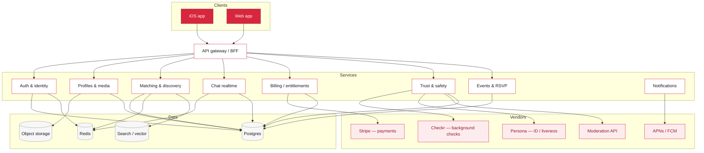

# Cardinal — technical build plan

How to take the client-side demo in this folder and turn it into a real,
production dating app. The demo proves the product; this proves the path.

Everything the demo fakes in `localStorage` maps to a real service below. The
demo is the spec — build the backend that makes each screen true.

---

## 1. From demo to production, at a glance

| Demo (today) | Production (this plan) |
|---|---|
| `localStorage` state | Postgres + object storage, behind an API |
| Simulated background check | **Checkr** or **Persona** (real criminal check + consent) |
| "Verify me" flips a flag | **Persona / Onfido** selfie-liveness + doc verification |
| No real login | Email + phone OTP + OAuth, JWT/session auth |
| Deterministic "mutual" like | Real two-sided likes, matches, and push notifications |
| First-message-only | Realtime chat (WebSocket) with moderation |
| Fake "$19.99/mo" upgrade | **Stripe** subscriptions + entitlements |
| Sample events | Events service + ticketing/check-in, calendar, waitlist |
| In-memory activity meter | Server-side activity events + analytics |

---

## 2. Architecture



Start as a **modular monolith** (one deployable, clean module boundaries as
above), not microservices. Split out Chat and Trust & Safety only when scale or
team size demands it.

---

## 3. Recommended stack

- **Client:** keep the web app (this demo's HTML/CSS/JS is a fine prototype);
  rebuild as **React + TypeScript** (or React Native/Expo to share code with
  iOS). The repo already has a native iOS app (`CardinalPress/`) — the dating
  app can start web-first and add native later.
- **API:** **Node + TypeScript (NestJS)** or **Go**. TypeScript lets you share
  types with the web client. GraphQL or REST — REST is simpler to start.
- **DB:** **Postgres** (primary), **PostGIS** for geo ("near me"),
  **Redis** for sessions/queues/rate-limits, **object storage** (S3/R2) for
  photos, a **search index** (OpenSearch or pgvector) for discovery ranking.
- **Realtime:** WebSockets (managed: Ably/Pusher, or self-host with Redis
  pub/sub) for chat and match notifications.
- **Infra:** containers on a managed platform (Fly.io/Render to start, ECS/GKE
  at scale), IaC (Terraform), CI/CD from GitHub Actions (repo already has
  workflows).

---

## 4. Core data model (starting point)

```
users(id, phone, email, created_at, status)              -- status: pending|active|banned
profiles(user_id, name, dob, gender, seeking, intent,
         city, geo POINT, bio, prompt, prompt_answer, color)
photos(id, user_id, url, is_primary, moderation_state)
verifications(user_id, kind, status, ref, provider, checked_at)  -- kind: photo|background
memberships(user_id, plan, status, current_period_end, stripe_customer_id)  -- plan: free|plus|women_free
likes(from_user, to_user, created_at)                    -- unique(from,to)
matches(id, user_a, user_b, created_at)                  -- derived from mutual likes
messages(id, match_id, sender, body, created_at, moderation_state)
blocks(user_id, blocked_user_id)
reports(id, reporter, target, reason, status, created_at)
events(id, title, type, city, starts_at, capacity)
rsvps(event_id, user_id, status)                         -- going|waitlist|cancelled
activity_events(user_id, kind, ts)                       -- for the "stay active" metric
```

Demo → model mapping: the `FLOCK` array → `profiles`; `state.matches` →
`matches`; `state.rsvps` → `rsvps`; `state.activity` → aggregated
`activity_events`; `state.profile.membership` → `memberships`;
`state.blocked` → `blocks`.

---

## 5. The hard integrations (where the real work is)

### 5.1 Background checks — legally the heaviest piece
- **Vendor:** Checkr or Persona (criminal background). Flow: collect consent →
  submit PII → async webhook returns `clear` / `consider` → gate account
  activation on `clear`.
- **Legal:** in the US, consumer background checks fall under the **FCRA** —
  you need explicit disclosure + consent, adverse-action notices if you reject
  someone, and you must **not** store raw report data loosely. This needs real
  legal review; it is not just an API call. Budget for a lawyer.
- **Cost:** ~$15–$30 per check — a real unit cost. Decide who eats it (likely a
  gate for all, or a paid add-on).

### 5.2 Photo verification / liveness
- **Vendor:** Persona or Onfido — selfie + liveness matched against profile
  photos. Store only pass/fail + a reference, never the raw selfie beyond the
  provider's retention window. Powers the `verified` badge.

### 5.3 Payments (Cardinal+ $19.99/mo)
- **Vendor:** Stripe. Model as a subscription with an **entitlements** table the
  API checks on every gated action (unlimited likes, see-who-liked-you).
  Handle webhooks for renewals, failures, cancellations, refunds, chargebacks.
- **App stores:** if you ship native iOS, Apple requires **StoreKit / in-app
  purchase** for digital subscriptions (15–30% cut) — you can't just use Stripe
  in-app. Web-based subscription is cheaper; plan the funnel accordingly.
- The demo's like-cap and paywall logic already models the entitlement checks.

### 5.4 Events & ticketing
- Own the events service; use a payments/ticketing rail (Stripe, or Eventbrite
  API) for paid events. Add capacity, waitlist, check-in (QR), and post-event
  safety follow-up. "Free for women, Cardinal+ priority" = entitlement + RSVP
  ordering rules.

---

## 6. Realtime chat + moderation
- WebSocket per match thread; persist to `messages`; Redis pub/sub for fan-out.
- **Every message** runs through moderation (Hive/OpenAI moderation or similar)
  for harassment, sexual content, and PII/scam patterns **before** delivery or
  async with fast takedown. This is core to the women-first promise, not a
  nice-to-have.
- Read receipts, typing, and rate limits (anti-spam) live here too.

---

## 7. Trust & safety (the product's spine)
- **Reporting pipeline:** `reports` → triage queue → human moderators →
  action (warn/suspend/ban) → audit log. Blocking is instant and mutual.
- **Signals:** velocity (mass-liking), duplicate photos (perceptual hashing),
  device/IP fingerprinting for ban evasion, and known-bad phone/email lists.
- **Women-first controls, server-side:** incognito, hide-from-discovery, and
  "who can message" become real access rules, not just UI toggles.

---

## 8. Matching & discovery
- Candidate generation: geo + age + intent + seeking filters (PostGIS + SQL).
- Ranking: start with heuristics (recency, activity, mutual interests,
  reciprocity likelihood); graduate to a learned model (pgvector embeddings of
  prompts/interests) once you have interaction data.
- The demo's "curated small deck" = a capped, ranked candidate list per day.

---

## 9. Security, privacy, compliance
- **PII minimization:** DOB, background data, and photos are sensitive. Encrypt
  at rest, restrict access, log every read of verification data.
- **Regulatory:** GDPR/CCPA (data export + deletion), age-gating (18+, enforced
  by DOB + verification), FCRA (background checks), app-store safety policies.
- **Abuse & safety by design:** account deletion that actually purges, a
  "block on signup" list, and a documented law-enforcement response process.

---

## 10. Build phases (mapped to the demo)

**Phase 0 — Foundations (2–4 wks):** auth (phone OTP), profiles + photo upload,
Postgres, the web client wired to a real API. *Demo screens made real: onboard,
profile, discover (static ranking).*

**Phase 1 — The loop (3–5 wks):** likes → matches → realtime chat with
moderation; block/report pipeline. *Demo: matches, likes-you, messaging.*

**Phase 2 — Trust gate (4–6 wks, + legal):** photo verification (Persona) and
background check (Checkr) with the consent/adverse-action flow; the join gate
becomes real. *Demo: verification badge, background check, join gate.*

**Phase 3 — Money (2–4 wks):** Stripe subscriptions + entitlements; free-vs-
Cardinal+ gating; women-free logic. *Demo: pricing, like-cap, see-who-liked-you.*

**Phase 4 — Community (3–5 wks):** events service, RSVP/waitlist/check-in,
notifications. *Demo: events.*

**Phase 5 — Hardening & scale:** moderation ML, matching model, observability,
load testing, on-call.

---

## 11. Rough monthly cost drivers (order of magnitude, pre-scale)
- Background checks: **per-user unit cost** ($15–30 each) — the big one.
- ID/liveness verification: ~$1–2 per verification.
- Payments: Stripe ~2.9% + 30¢ (or 15–30% via App Store in-app).
- Moderation API: per-message/image, small but real at volume.
- Infra: modest to start (a few hundred $/mo on Fly/Render + Postgres + Redis).

The unit economics hinge on: **background-check cost per signup** vs.
**Cardinal+ conversion on the men's side**. Model that spreadsheet before
committing — it's the whole business in two numbers.

---

## 12. Biggest risks / open questions
1. **Background-check economics & law (FCRA)** — cost per signup and legal
   exposure. Needs counsel before launch. Could gate to paid users only.
2. **Cold-start liquidity** — the women-first bet needs real seeding
   (events, referrals, a launch city). Tech can't solve an empty city.
3. **App Store payments** — native iOS forces in-app purchase economics.
4. **Moderation at scale** — human review is a real, ongoing operational cost.
5. **"Free for women" abuse** — fake female accounts to get free access; the
   verification + background gate is also your defense here.

---

*This plan is a starting map, not gospel — sequence and vendors should flex to
budget, team, and the launch city. The demo in this folder is the reference for
what each finished screen should do.*
