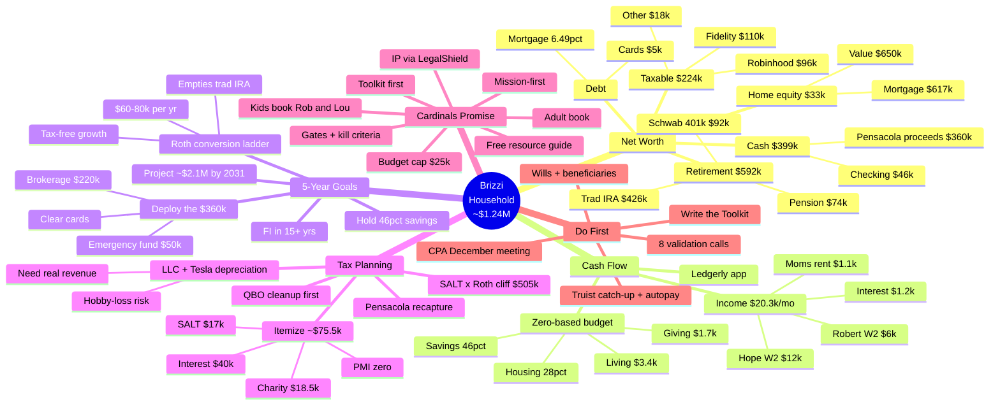

# Brizzi Household — Financial Mind Map

A one-glance map of everything from this engagement. Renders visually on
GitHub. Detail lives in the linked docs.

## The six documents

| Doc | What |
|---|---|
| `financial-picture.md` | Net worth, cash flow, structure |
| `financial-goals-2026-2031.md` | 5-year plan + Roth ladder |
| `tax-planning.md` | Itemized, SALT/Roth, vehicle, CPA agenda |
| `launch-plan.md` | The Cardinal's Promise venture |
| `ledgerly/` | The budgeting app |
| `analysis/` | QuickBooks ratio analysis |
