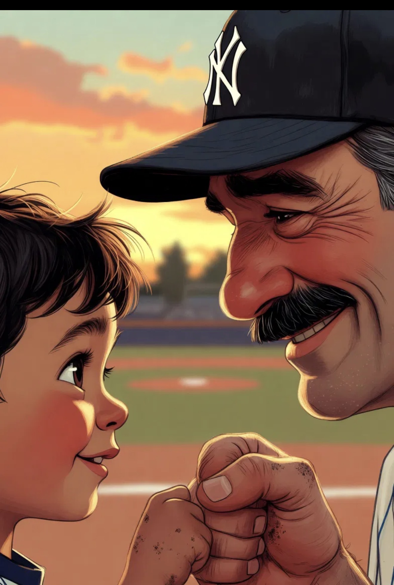

# The Sundown Fist Bump

*A read-aloud story · ages 4 to 8*
*for every kid way out in right field*

---

**1.**
On the last day of summer ball, the sky turned the color of orange popsicles.
Theo had never caught a fly ball. Not once, all season.

**2.**
Every practice, Coach Sal said the same thing: *"Gloves up, eyes up, hearts up!"*
And every practice, the ball found somebody else's glove.

**3.**
Tonight was the last game. Theo stood way out in right field, where the dandelions grew, and whispered,
*"Please don't come to me. Please don't come to me."*

**4.**
**CRACK!**
The ball went up, up, up — over second base, over the shortstop's head — straight toward the dandelions.

**5.**
Theo's legs wanted to run away.
But his glove remembered: *gloves up.* His eyes remembered: *eyes up.* And his heart — his heart was already up, banging like a drum.

**6.**
The ball came down like a little white moon…
…and landed in the grass, two steps away. Theo missed it.

**7.**
The other team cheered. Theo's ears went hot.
He grabbed the ball and threw it as hard as he had ever thrown anything — and it flew true, all the way to second base, right on time.
**"OUT!"** called the umpire.

**8.**
Theo blinked.
Had *he* done that?

**9.**
After the game, when the sun slid low and the whole field turned gold, Coach Sal knelt down in the infield dirt, so his eyes were right at Theo's eyes.

**10.**
*"I dropped it, Coach,"* Theo said.
*"I know,"* said Coach Sal, his mustache wiggling into a smile. *"And then you kept playing. That's the bravest play in baseball."*

**11.**
He held out one big, dusty fist.
Theo held out one small, dusty fist.

**12.**
**Bump.**
*"Same time next spring?"* asked Coach Sal.
*"Gloves up,"* said Theo. *"Eyes up. Hearts up."*

---

*The End.*
